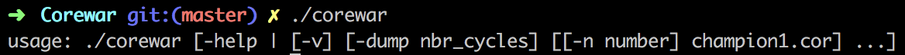
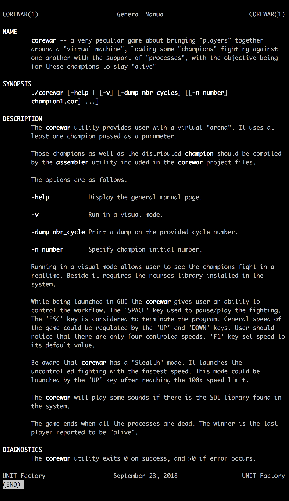
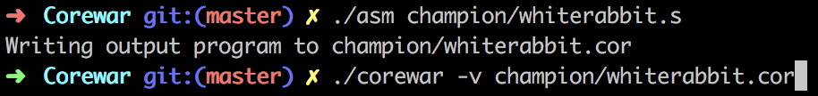
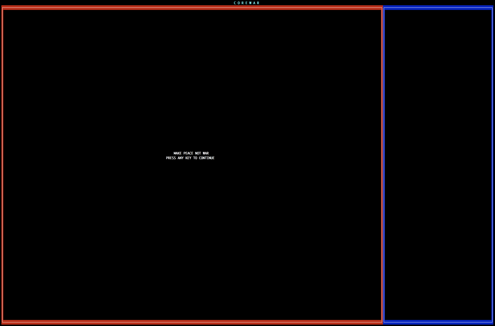
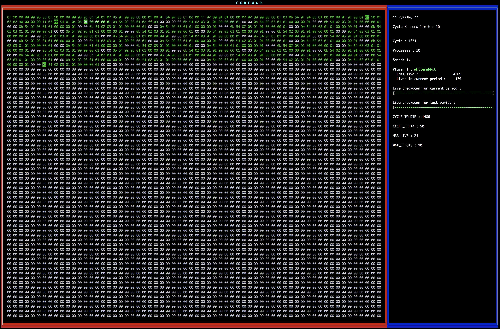

## Prerequisites

To compile source files you have to install _ncurses_ and _SDL2_ libraries.

## How-to

After successful compilation type the following command to get usage:

General Manual page contains detailed explanation of the project and it looks like this:

To run the program follow these steps:

Start screen of the virtual machine in graphical mode looks as follows:

Example of virtual machine execution:

